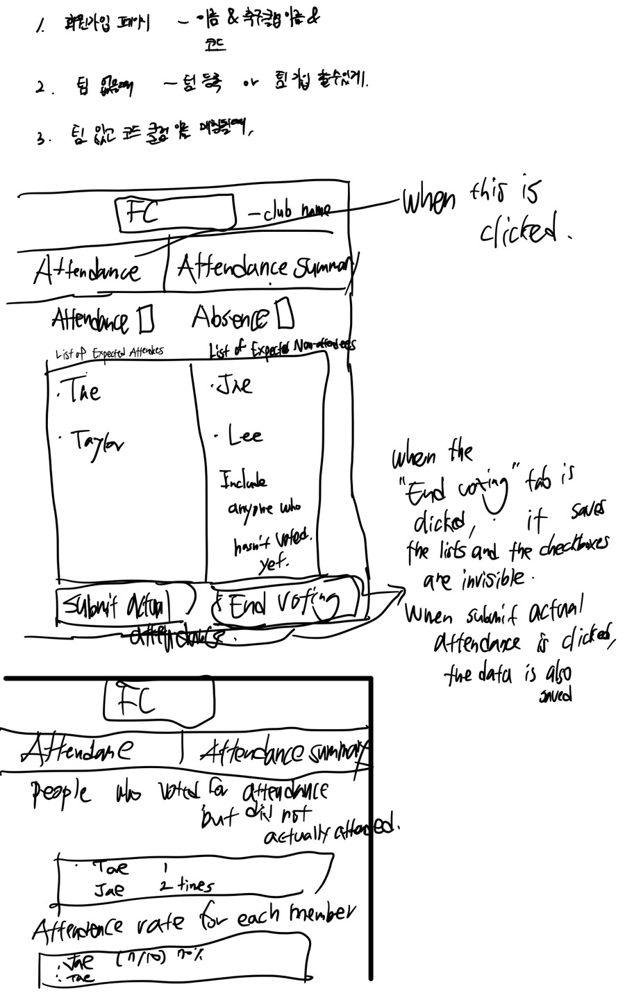

# Startup
notes.md -> https://github.com/taehk98/startup/blob/main/notes.md

current URL => https://startup.manageyourclub.click

# Soccer Clue Attendance checker

This application allows Soccer clubs to take their members' attendance every week. The administers of the clubs can start votings and end them. People need their certain clubs' codes to sign up to their clubs.

## Specification Deliverable

### Elevator pitch

Our soccer club attendance check application simplifies the process of tracking and managing player attendance. Easily monitor who's present and who's not, streamline communication with team members, and ensure everyone is on the same page. Our application enhances the efficiency of managing soccer club attendance. Join us in revolutionizing the way we take attendance in soccer clubs!

### Design

### Key features

- Secure Login over HTTPS
- Ability to Choose Between the 'Will Attend' Button and the 'Will Be Absent' Button
- Display of Attendance Summary of Members
- Tracking of People Who Voted for 'Will Attend' but Did Not Actually Attend
- Ability to Join Specific Clubs.
- Display of Name Lists of Attendees and Non-attendees in Real-time
- Ability for a User to Create and End Attendance poll and Check Actual Attendance
- Persistent Storage of Club Members' Attendance

### Technologies

I am going to use the required technologies in the following ways.

- **HTML** - Uses correct HTML structure for application. Three HTML pages. One for login, one for attendance poll, and one for attendance summary. Hyperlinks to choice artifact.
- **CSS** - Styling for the application that presents an appealing visual appearance across various screen sizes, incorporates effective use of whitespace, and employs well-thought-out color choices and contrasts.
- **JavaScript** - Provides login, attendance polls display, applying votes, display other users votes on two lists, backend endpoint calls.
- **Service** - Backend service with endpoints for:
  - login
  - retrieving choices
  - submitting votes
  - retrieving vote status
- **DB/Login** - Store users, choices, and polls in database. Register and login users. Credentials securely stored in database. Can't create or end attendance polls unless authenticated.
- **WebSocket** - As each user votes, their names on the 'Will Attend' list the 'Will Be Absent' list are broadcast to all other users.
- **React** - Application ported to use the React web framework.

## HTML deliverable

- **HTML pages** - Four HTML page that represent the ability to login, vote, report.
- **Links** - The login page automatically links to the attendance page. Every page can be reached from each other. 
- **Text** - The two reports on the report.html page are represented by a textual description.
- **Images** - I added a soccer pitch picture on the about page and a sccoer ball drawing next to the title of the page.
- **DB/Login** - Stores Club codes, members, votes in database. Can't join teams unless people have specific code for their teams.
- **WebSocket** - When individuals check the checkboxes, their names will be added to the list based on their selections. People will be able to see other people's realtime choises.
- **Web Service** - On the attendance page, the place where they are going to play at is shown by using map API.
## CSS deliverable

- **Header, footer, and main content body** - Tried to made them concise. On the homepage they are at center so that people can feel like it is neat. A placeholder for webservice still exists.
- **Navigation elements** - I used one of the navigations on bootstrap and modified it.
- **Responsive to window resizing** - I used flexbox and dev tools to make sure my application outline works on both mobile and desktop.
- **Application elements** - Used good colors and whitespace. Tried to make it clean and neat.
- **Application text content** - Tried to use consistent fonts.
- **Application images** - Made a logo for the application and use it on the login page. Its size reflects on the size of the screen.

## JavaScript deliverable

- **login** - When you press the login or sign up button it takes you to the attendance page. When you sign up, it checks if there is a club name you provide and create one if there is not. 
- **database** - It currently stores users' clubID, indicating whether the user plans to attend and has actually attended, along with the number of attendances, the number of absences, and the number of "fake" attends in local storage.
- **WebSocket** - When members of your club make changes for attendance vote, it will be reflected by websocket and saveAttend method I created in this part.
- **application logic** - When users click the "End Voting" button, the lists for both attendees and absentees will be stored in local storage with a boolean property indicating their attendance intention. Moreover, the titles of the lists, initially "Will Present" and "Will Be Absent," will be updated to "Was Present" and "Was Not Present," respectively. Additionally, when users click the "Save Actual Attendance Records" button after recording actual participation, the data will be saved with a boolean property indicating actual attendance. Subsequently, the attendance rate and fake attendance number properties will be updated accordingly. Also, the attendance and report pages look different for each club.

## Service deliverable
I added backend endpoints for getting and updating attendances.

- **Node.js/Express HTTP service** - done!
- **Static middleware for frontend** - done!
- **Calls to third party endpoints** - My app utilizes the football-data.org API to retrieve information on Premier League matches, and I generate a table with it.
- **Backend service endpoints** - created: /get-attendances, /update-attendances, /replace-attendances, /soccer-results
- **Frontend calls service endpoints** - Fetching match attendance data from /get-attendances, updating attendance records via /update-attendances, replacing attendance data using /replace-attendances, retrieving soccer match results from /soccer-results.

## DB/Login deliverable

- **MongoDB Atlas database created** - 
- **Stores data in MongoDB** - 
- **User registration** - 
- **existing user** - 
- **Use MongoDB to store credentials** - 
- **Restricts functionality** - 

## WebSocket deliverable

- **Backend listens for WebSocket connection** -
- **Frontend makes WebSocket connection** - 
- **Data sent over WebSocket connection** - 
- **WebSocket data displayed** - 

## React deliverable

- **Bundled and transpiled** - 
- **Components** - 
- **Router** - 
- **Hooks** - 
